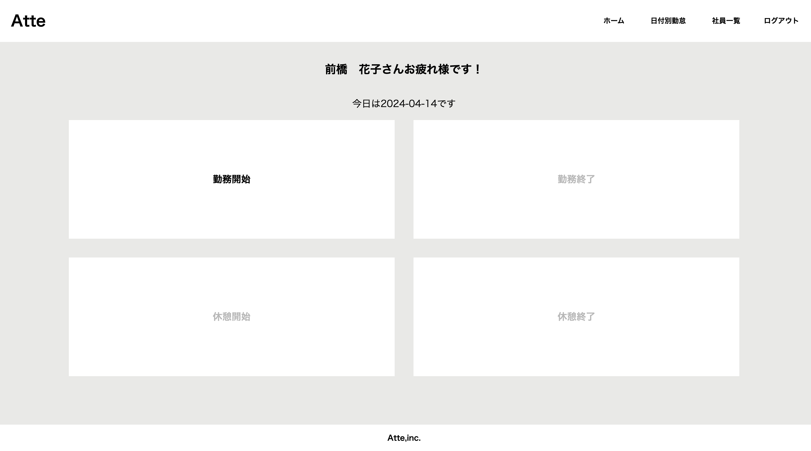
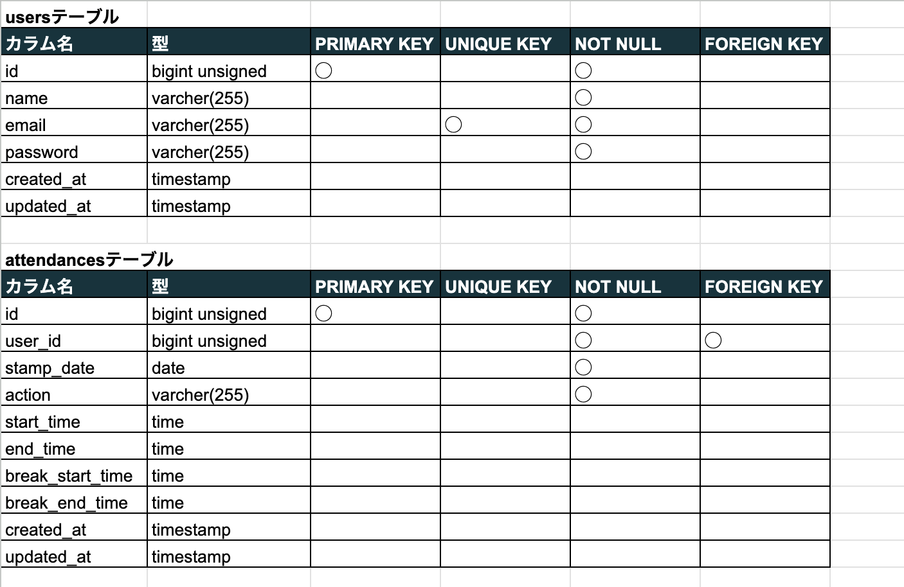
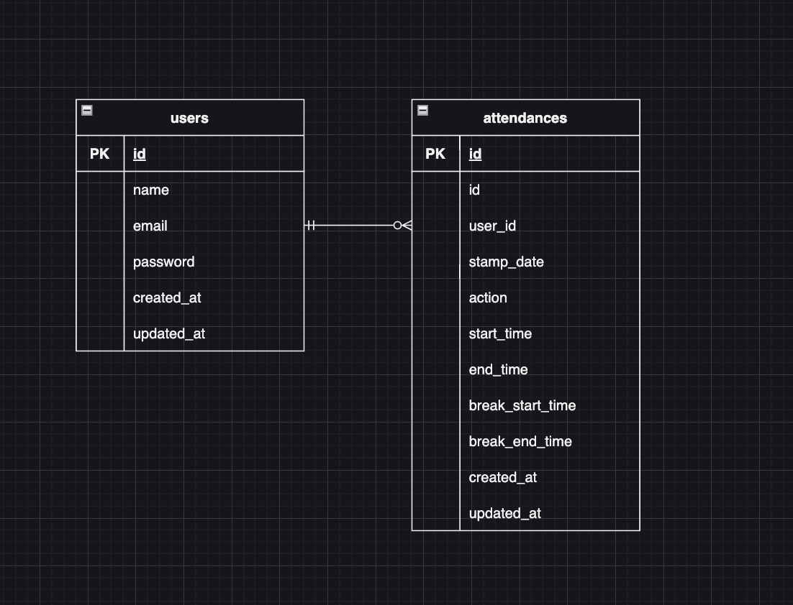

# アプリケーション名：Atte(アット)
概要説明
・Atte（アット）は企業の勤怠管理システムです。


## 作成した目的
概要説明
・人事評価のために従業員の勤怠情報を正確に把握・管理できます。
・テレワークなど多様な働き方に対応できます。

## URL
- アプリケーション:http://52.68.24.194/
- 開発環境:http://localhost/
- phpMyAdmin:http://localhost:8080/

## 会員登録とログイン
- 名前、メールアドレス、パスワードの入力が必要です。
- パスワードは８文字以上で設定してください。
- ログインはメールアドレスとパスワードを入力して行います。

## 機能一覧
### 従業員の出勤・退勤時刻、休憩開始・休憩終了時刻を記録
従業員が出勤した際には、出勤時刻が記録されます。また、退勤時刻や休憩開始・終了時刻も同様に記録されます。
### 日付別勤怠情報を一覧で確認
日付ごとに従業員の勤怠情報を一覧で表示し、確認することができます。
### 登録済みの従業員名を一覧で確認
システムに登録されている従業員の名前を一覧で表示し、確認することができます。
### 従業員別の勤怠情報を月毎に一覧で確認
各従業員の月毎の勤怠情報を一覧で表示し、確認することができます。

## 使用技術(実行環境)
- Apache 2.4.56
- Nginx 1.21.1
- PHP 8.2.15
- Composer 2.7.2
- Laravel 8.83.27
- MySQL 8.0.36

## テーブル設計


## ER図


## 環境構築
**Dockerビルド**
1. `git clone gitgit@github.com:mayumikawanami/attendance_management.git`
2. DockerDesktopアプリを立ち上げます。
3. `docker-compose up -d --build` を実行します。

**Laravel環境構築**
1. `docker-compose exec php bash` を実行して、phpコンテナに入ります。
2. `composer install` を実行して、依存関係をインストールします。
3. `.env.example` ファイルを `.env` にコピーします。
4. `.env` ファイル内の以下の環境変数を設定します。
```plaintext
DB_CONNECTION=mysql
DB_HOST=mysql
DB_PORT=3306
DB_DATABASE=laravel_db
DB_USERNAME=laravel_user
DB_PASSWORD=laravel_pass
```
5. アプリケーションキーを生成します。
``` bash
php artisan key:generate
```

6. マイグレーションを実行します。
``` bash
php artisan migrate
```

7. シーディングを実行します。
``` bash
php artisan db:seed
```
